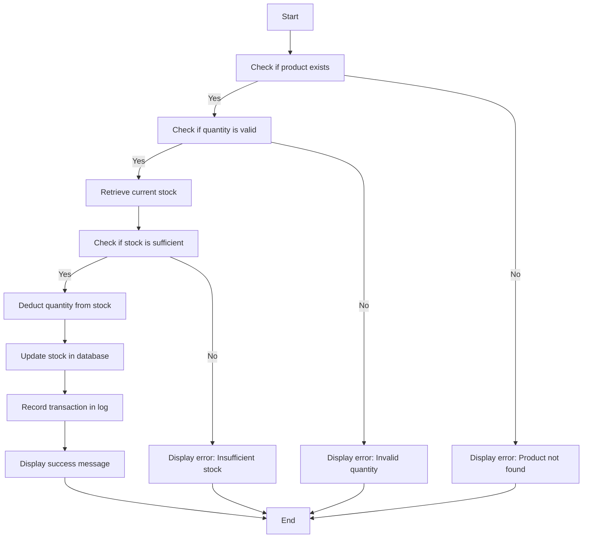

```mermaid
graph TD;
    A[Start] --> B[Check if product exists];
    B --> |Yes| C[Check if quantity is valid];
    C --> |Yes| D[Retrieve current stock];
    D --> E[Check if stock is sufficient];
    E --> |Yes| F[Deduct quantity from stock];
    F --> G[Update stock in database];
    G --> H[Record transaction in log];
    H --> I[Display success message];
    C --> |No| J[Display error: Invalid quantity];
    E --> |No| K[Display error: Insufficient stock];
    B --> |No| L[Display error: Product not found];
    I --> M[End];
    J --> M;
    K --> M;
    L --> M;
```
