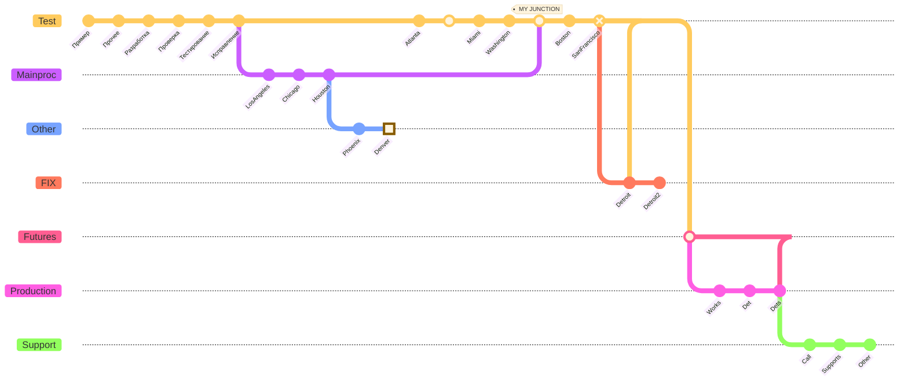

## Sample branch

```mermaid
%%{init: { 'logLevel': 'debug', 'theme': 'base', 'gitGraph': {'showBranches': true, 'showCommitLabel':true,'mainBranchName': 'Test'}} }%%
      gitGraph
        commit id:"Пример"
        commit id:"Прочее"
        commit id:"Разработка"
        commit id:"Проверка"
        commit id:"Тестирование"
        commit id:"Исправление"
         
        
      branch Mainproc
        commit id:"LosAngeles"
        commit id:"Chicago"
        commit id:"Houston"
      
      branch Other
        commit id:"Phoenix"
        commit type: HIGHLIGHT id:"Denver"
        commit id:"Boston"
        checkout Test
        commit id:"Atlanta"
        merge Other
        commit id:"Miami"
        commit id:"Washington"
        merge Mainproc tag:"MY JUNCTION"
        commit id:"Boston"
        commit id:"Detroit"
        commit type:REVERSE id:"SanFrancisco"
        
      branch FIX
        commit id:"Detroit"
        commit id:"Detroit2"
         
        
      branch Futures
        commit id:"Works"
        commit id:"Det"
        commit id:"Dets"
        merge Other
        
     branch Production
        commit id:"Works"
        commit id:"Det"
        commit id:"Dets"
        
     branch Support
        commit id:"Call"
        commit id:"Supports"
        commit id:"Other"
        
        
        
```        

## Sample branch other

```mermaid
%%{init: { 'logLevel': 'debug', 'theme': 'neutral' } }%%
      gitGraph
        commit
        branch hotfix
        checkout hotfix
        commit
        branch develop
        checkout develop
        commit id:"ash" tag:"abc"
        branch featureB
        checkout featureB
        commit type:HIGHLIGHT
        checkout main
        checkout hotfix
        commit type:NORMAL
        checkout develop
        commit type:REVERSE
        checkout featureB
        commit
        checkout main
        merge hotfix
        checkout featureB
        commit
        checkout develop
        branch featureA
        commit
        checkout develop
        merge hotfix
        checkout featureA
        commit
        checkout featureB
        commit
        checkout develop
        merge featureA
        branch release
        checkout release
        commit
        checkout main
        commit
        checkout release
        merge main
        checkout develop
        merge release
```        
