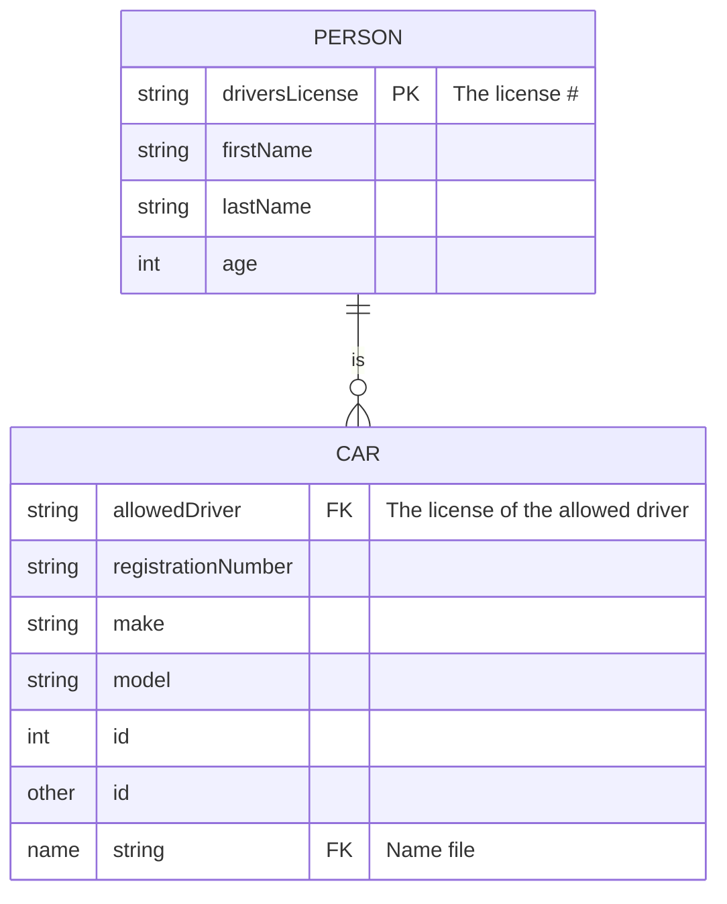
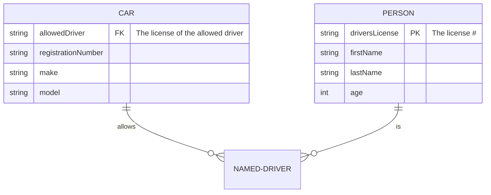
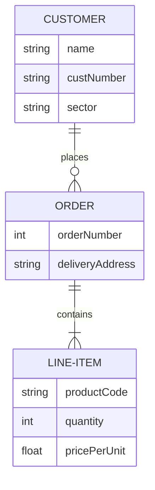
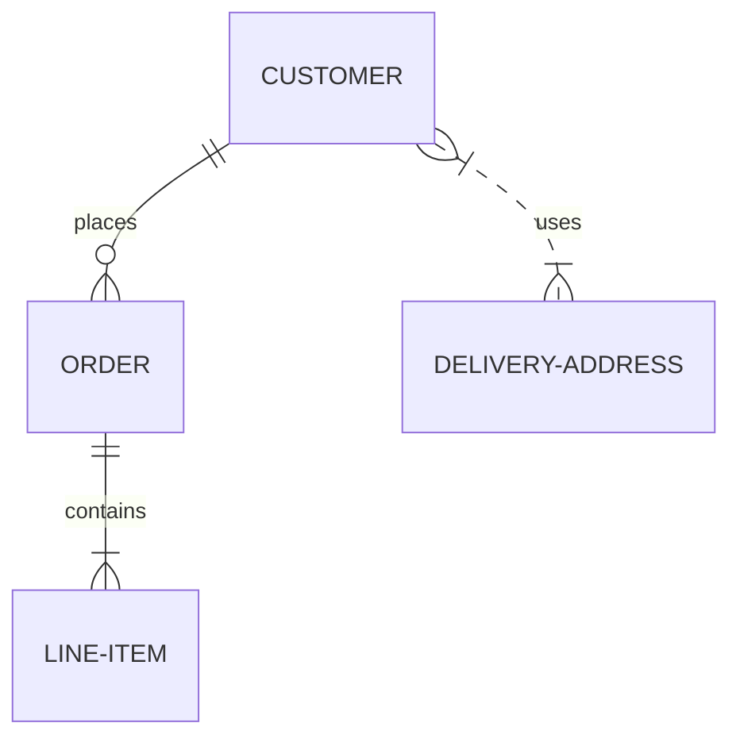

## Diagram

```mermaid
erDiagram
  PERSON ||--o{ CAR : is
 PERSON {
        string driversLicense PK "The license #"
        string firstName
        string lastName
        int age
    }

 CAR {
        string allowedDriver FK "The license of the allowed driver"
        string registrationNumber
        string make
        string model
        int id
        other id
        name string FK "Name file"
    }
``` 

## Diagram process

```mermaid
erDiagram
    CAR ||--o{ NAMED-DRIVER : allows
    CAR {
        string allowedDriver FK "The license of the allowed driver"
        string registrationNumber
        string make
        string model
    }
    PERSON ||--o{ NAMED-DRIVER : is
    PERSON {
        string driversLicense PK "The license #"
        string firstName
        string lastName
        int age
    }
```    

## Diagram process

```mermaid
erDiagram
    CUSTOMER ||--o{ ORDER : places
    CUSTOMER {
        string name
        string custNumber
        string sector
    }
    ORDER ||--|{ LINE-ITEM : contains
    ORDER {
        int orderNumber
        string deliveryAddress
    }
    LINE-ITEM {
        string productCode
        int quantity
        float pricePerUnit
    }
```
## Diagram users

```mermaid
erDiagram
    CUSTOMER ||--o{ ORDER : places
    ORDER ||--|{ LINE-ITEM : contains
    CUSTOMER }|..|{ DELIVERY-ADDRESS : uses
```    
