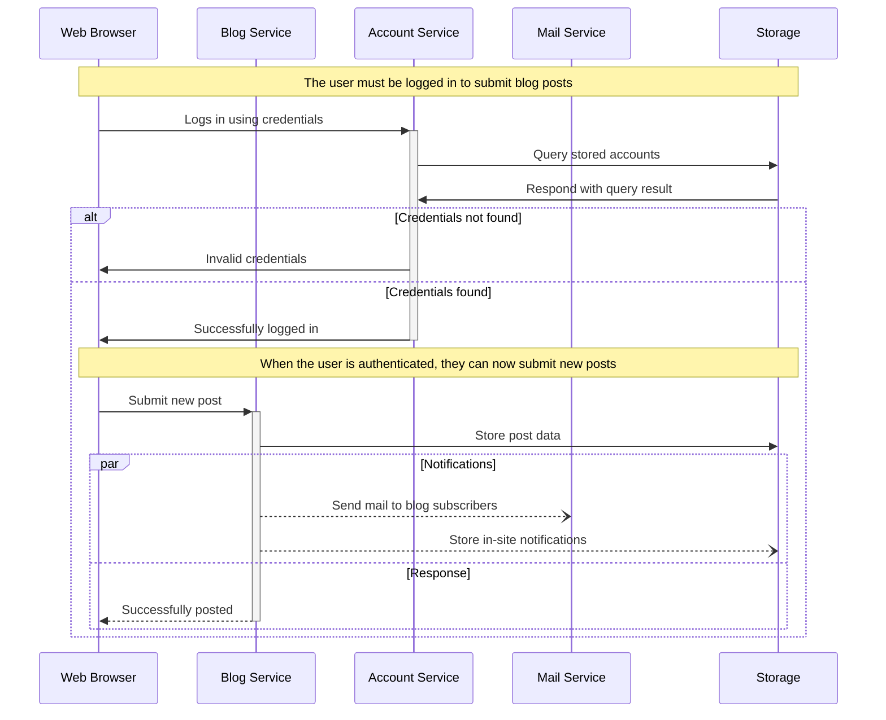
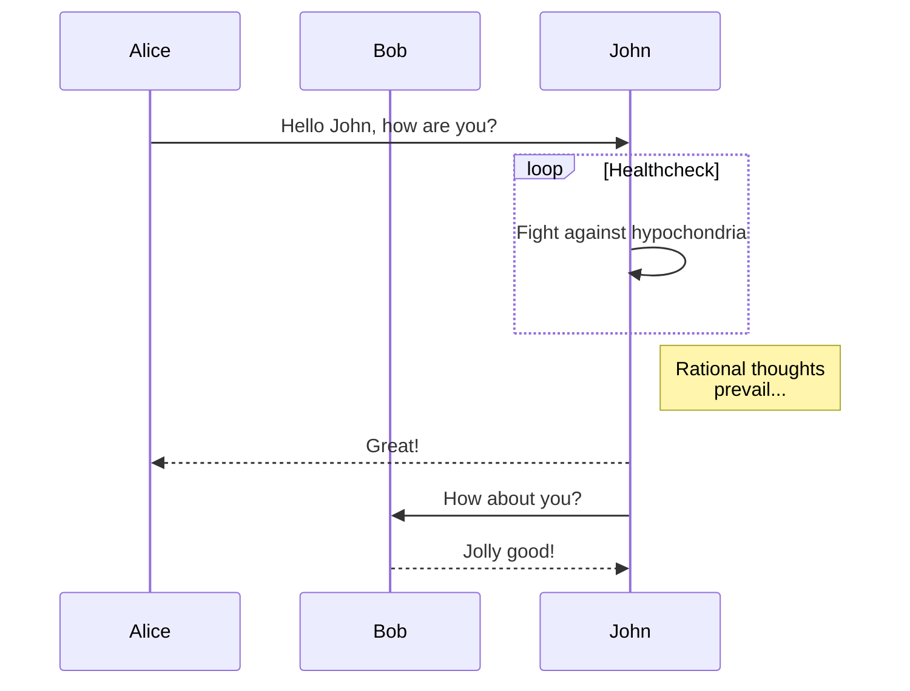
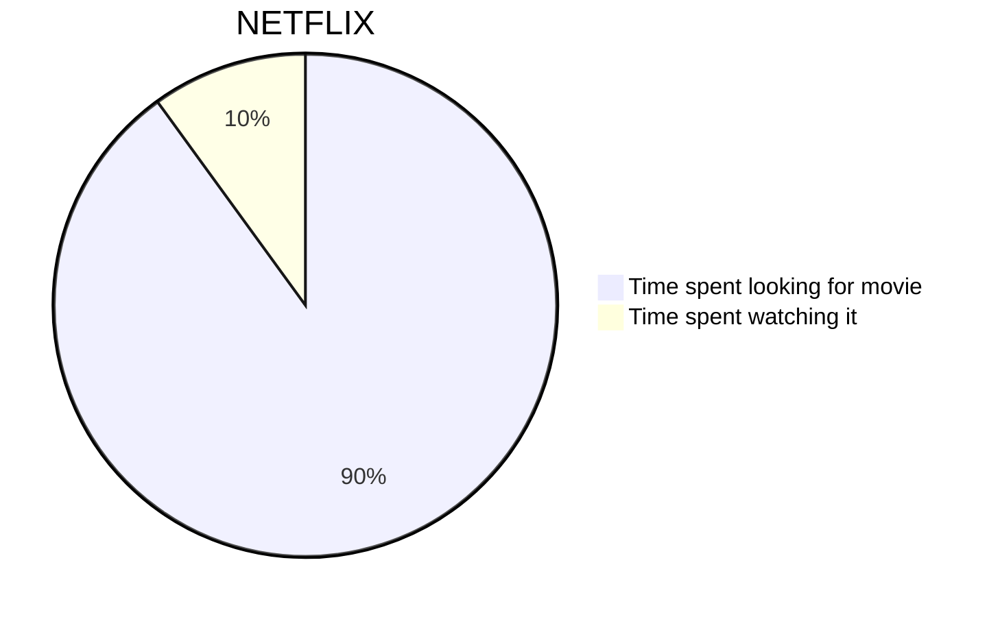

## Basic process

```mermaid
sequenceDiagram
    participant web as Web Browser
    participant blog as Blog Service
    participant account as Account Service
    participant mail as Mail Service
    participant db as Storage

    Note over web,db: The user must be logged in to submit blog posts
    web->>+account: Logs in using credentials
    account->>db: Query stored accounts
    db->>account: Respond with query result

    alt Credentials not found
        account->>web: Invalid credentials
    else Credentials found
        account->>-web: Successfully logged in

        Note over web,db: When the user is authenticated, they can now submit new posts
        web->>+blog: Submit new post
        blog->>db: Store post data

        par Notifications
            blog--)mail: Send mail to blog subscribers
            blog--)db: Store in-site notifications
        and Response
            blog-->>-web: Successfully posted
        end
    end
```

## Other process

```mermaid
sequenceDiagram
    participant Alice
    participant Bob
    Alice->>John: Hello John, how are you?
    loop Healthcheck
        John->>John: Fight against hypochondria
    end
    Note right of John: Rational thoughts<br/>prevail...
    John-->>Alice: Great!
    John->>Bob: How about you?
    Bob-->>John: Jolly good!
```

## Graph

```mermaid
pie title NETFLIX
         "Time spent looking for movie" : 90
         "Time spent watching it" : 10
```
