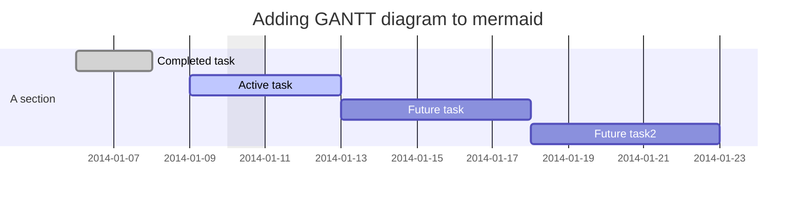
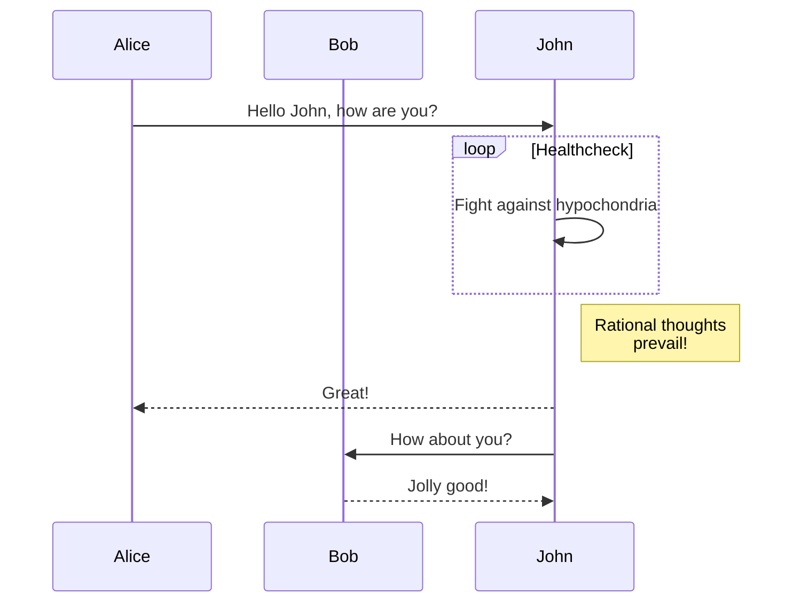
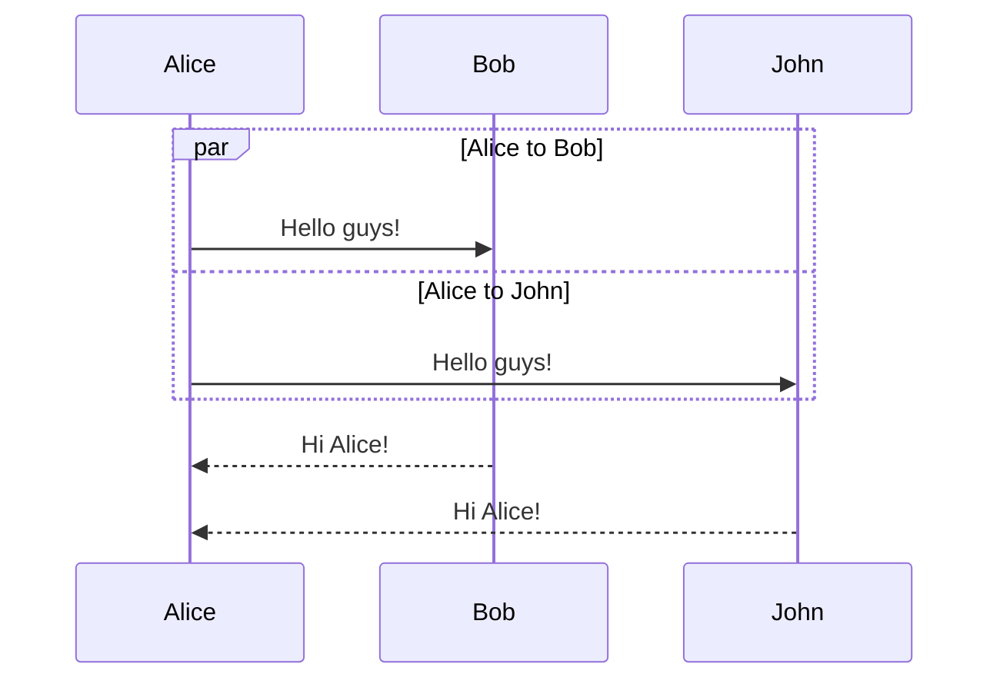
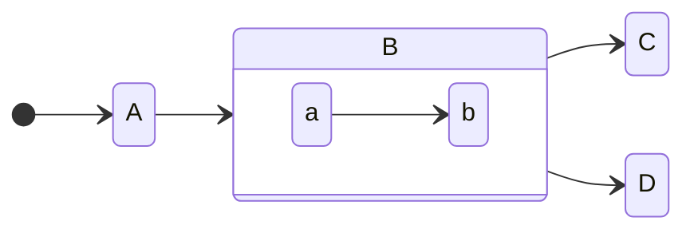

## Plan and Craph

https://mermaid-js.github.io/mermaid/#/gantt
https://mermaid-js.github.io/mermaid/#/Tutorials
https://docs.github.com/en/get-started/writing-on-github/working-with-advanced-formatting/creating-diagrams

## Mer

## Diagram

## Satate diagram

https://mermaid.live/edit

