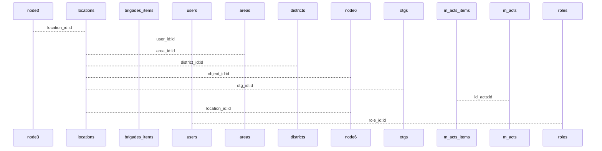

# Out JSON file to relation tables


  

## Table relations
```sql
CREATE TABLE `m_acts` (
  `id` int NOT NULL AUTO_INCREMENT,
  `num` varchar(45) DEFAULT NULL,
  `company` varchar(45) DEFAULT NULL,
  `created_at` varchar(45) DEFAULT NULL,
  `total` float DEFAULT NULL,
  PRIMARY KEY (`id`)
) ENGINE=InnoDB;

CREATE TABLE `m_acts_items` (
  `id` int NOT NULL AUTO_INCREMENT,
  `id_acts` int DEFAULT NULL,
  `title` varchar(45) DEFAULT NULL,
  `summ` float DEFAULT NULL,
  PRIMARY KEY (`id`),
  KEY `fg_acts_idx` (`id_acts`),
  CONSTRAINT `fg_acts` FOREIGN KEY (`id_acts`) REFERENCES `m_acts` (`id`)
) ENGINE=InnoDB;
```

## GO 
```go
package project

import (
	"boiler/controllers/db"
	"github.com/labstack/echo/v4"
	"log"
)

type MActs struct {
	Id        int           `json:"id"`
	Num       string        `json:"num"`
	Company   string        `json:"company"`
	CreatedAt string        `json:"created_at"`
	Total     float64       `json:"total"`
	Items     []*MActsItems `json:"items" gorm:"foreignKey:IdActs"`
}

type MActsItems struct {
	Id     int     `json:"id"`
	IdActs int     `json:"id_acts"`
	Title  string  `json:"title"`
	Sum    float64 `json:"sum"`
}

// Get JSON Acts
func GetAct(e echo.Context) error {

	mActsList := []MActs{}

	result := db.DB.Preload("Items").Find(&mActsList)
	if result.Error != nil {
		log.Fatal(result.Error)
	}

	jsonData, err := json.Marshal(mActsList)
	if err != nil {
		log.Fatal("Error marshaling JSON:", err)
	}
	
	fmt.Println(string(jsonData))

	return e.JSON(200, mActsList)
}
```





