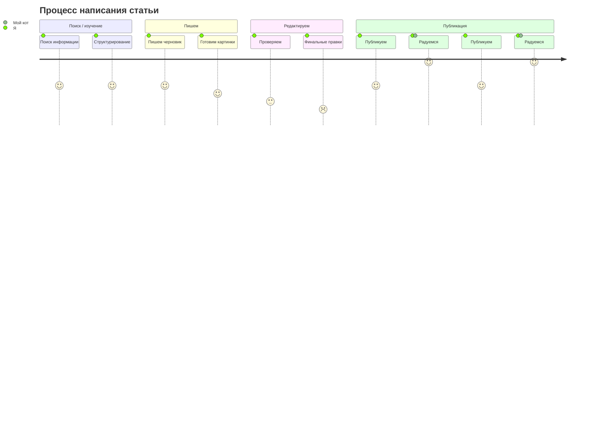
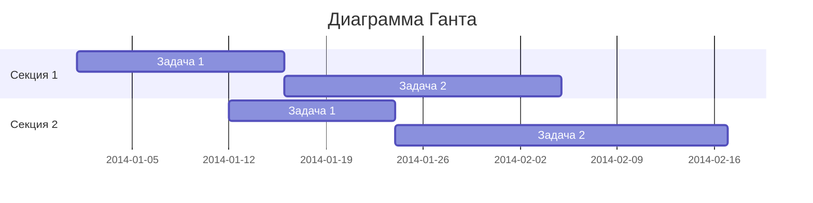
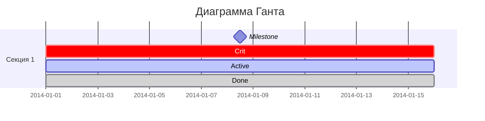

```mermaid
journey
    title Процесс написания статьи
    section Поиск / изучение
      Поиск информации: 5: Я
      Структурирование: 5: Я
    section Пишем
      Пишем черновик: 5: Я
      Готовим картинки: 4: Я
    section Редактируем
        Проверяем: 3: Я
        Финальные правки: 2: Я
    section Публикация
        Публикуем: 5: Я
        Радуемся: 8: Я, Мой кот
section Публикация
        Публикуем: 5: Я
        Радуемся: 8: Я, Мой кот
```

```mermaid
gantt
    title Диаграмма Ганта
    dateFormat  YYYY-MM-DD
    section Секция 1
    Задача 1         :a1, 2014-01-01, 15d
    Задача 2         :20d
    section Секция 2
    Задача 1         :2014-01-12  , 12d
    Задача 2         : 24d
```

## Description

crit — особенно важные задачи;
active — задачи в работе;
done — выполненные задачи;
milestone — вехи (единичные важные события).

```mermaid
gantt
    title Диаграмма Ганта
    dateFormat  YYYY-MM-DD
    section Секция 1
    Milestone   :milestone, a1, 2014-01-01, 15d
    Crit        :crit, a2, 2014-01-01, 15d 
    Active      :active, a3, 2014-01-01, 15d
    Done        :done, a4, 2014-01-01, 15d
```
